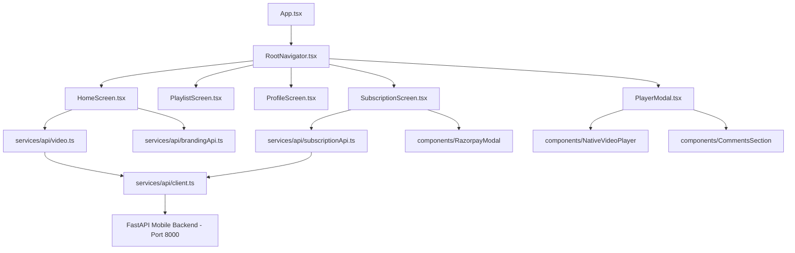

# Streamr Mobile App Architecture

Streamr is a high-performance React Native video streaming mobile application tailored for multi-tenant content creators.

## Architecture Overview

## Key Layers & Directories

### 1. Navigation (`src/navigation/`)
- `RootNavigator.tsx`: Stack navigator managing transitions between `Home`, `Playlist`, `Categories`, `CategoryDetail`, `Profile`, `Subscription`, `Search`, `VideoGrid`, `Login`, and `Settings`.

### 2. Services (`src/services/`)
- `api/client.ts`: Central HTTP client handling API requests, `Authorization: Bearer <JWT>` header injection, automatic token refresh, and creator ID query param passing.
- `api/authService.ts`: Manages user authentication, social logins (Google, Facebook, Auth0), anonymous guest sessions, local session persistence (`user_session_v1.json`), and subscription plan DB cache (`user_subscriptions_db.json`).
- `api/brandingApi.ts`: Queries live creator branding (`/api/v1/mobile/branding`) for studio name, logo URL, banner background, and accent colors.
- `api/subscriptionApi.ts`: Fetches creator plans (`/api/v1/mobile/plans`), queries subscriber status (`/api/v1/mobile/subscriptions/me`), creates Razorpay orders, and verifies payment signatures.
- `api/video.ts`: Retrieves paginated video catalog, detailed metadata, HLS stream URLs, captions, and determines ad placement (`adTagUrl`).
- `api/commentsApi.ts`: Native video comment threads, reply posting, and like actions.
- `downloadService.ts`: Offline HLS/MP4 video downloads using React Native FileSystem.
- `watchHistory.ts` & `viewTracker.ts`: Local and remote watch history progress and unique view count tracking.

### 3. Components (`src/components/`)
- `NativeVideoPlayer`: React Native video player with HLS playback, quality selection (720p vs 1080p), closed caption SRT/VTT parser, VAST ad integration, and full-screen landscape rotation via `react-native-orientation-locker`.
- `CommentsSection`: Full nested comment threads, avatar fallback, timestamp formatting, and optimistic reply UI.
- `RazorpayModal`: Native Razorpay checkout modal fallback and SDK handler.
- `BottomNavBar`: Fixed bottom navigation bar with active tab highlighting and smooth navigation handlers.
- `HeroBanner` & `CategoryTabs`: Dynamic creator header banner and filter pills.

### 4. Configuration (`src/constants/config.ts`)
- Configures environment variable fallbacks (`EXPO_PUBLIC_CREATOR_ID` / `REACT_APP_CREATOR_ID`), active creator ID getters/setters, default API URLs, and creator switch event listeners.